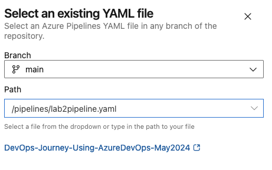
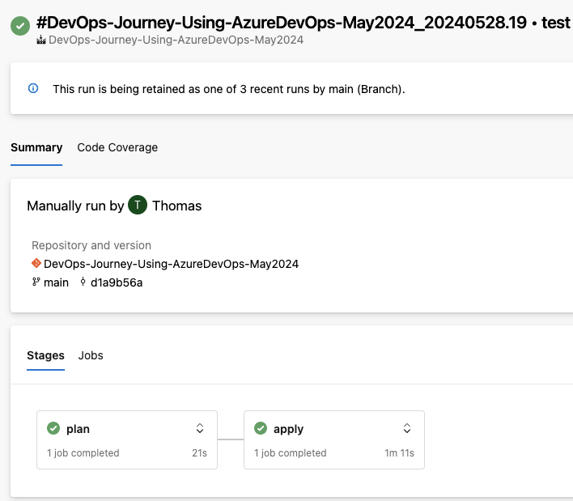

# Setting Up Azure DevOps Pipeline for Terraform Deployment

Follow these steps to configure Azure DevOps for deploying your Terraform configurations into Azure.

1. Install the Terraform extension/task from [here](https://marketplace.visualstudio.com/items?itemName=ms-devlabs.custom-terraform-tasks) into your Azure DevOps organisation

This extension allows you to run Terraform commands within Azure Build and Release Pipelines, supporting the following commands:

- `init`
- `validate`
- `plan`
- `apply`
- `destroy`

2. Create an Azure repository

Navigate to Repos in Azure DevOps. Here, you will find various options to set up a repository. Create a new repository to store your code. Note that this repository will be used for subsequent labs as well.

3. Update the Terraform .tfvars configuration

Update the [production.tfvars](https://github.com/thomast1906/DevOps-Journey-Using-Azure-DevOps/blob/main/labs/2-AzureDevOps-Terraform-Pipeline/vars/production.tfvars) file with your values. This file contains the values that will be used by Terraform to create the resources in Azure.

`access_policy_id` is the object group ID that you created as part of initial setup [here](https://github.com/thomast1906/DevOps-Journey-Using-Azure-DevOps/blob/main/labs/1-Initial-Setup/3-Create-Azure-AD-AKS-Admins.md) 

```hcl
access_policy_id = "01e9e3d0-bdd3-4b2a-b630-eff0ab594f59"
```

4. Copy contents from this folder into the newly created Azure DevOps repository

5. Once copied to Azure DevOps repository, Select **Repo** -> **Setup Build**


6. Select **Existing Azure Pipelines YAML file** and branch  / path to the .yaml Azure DevOps Pipeline



7. Save pipeline and run

