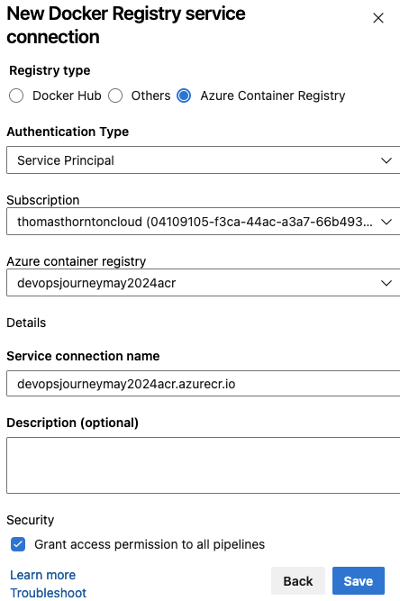
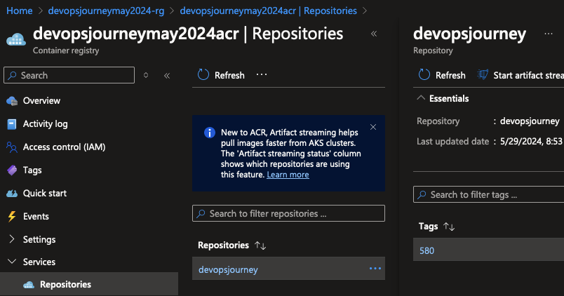

# Deploy sample Application to Container Registry

This lab will help you deploy a sample application to the Azure Container Registry (ACR).

1. Test the Docker Image Locally

Before deploying, you can build and run the Docker image locally to ensure it works correctly. Follow the instructions [here](docker-image-locally.md).

2. Build and Publish Docker Image to ACR

We aim to run the Docker build and publish the image directly to the Azure Container Registry created in lab 2.

3. Create a new service connection for ACR access.
- In your Azure DevOps Project, go to Project Settings.
- Select Service Connections.
- Click New Service Connection and choose Docker Registry.
- Select the registry type: Azure Container Registry.
- Choose the correct ACR and create a service connection name. For example, devopsjourneymay2024acr

4. Copy Application Folder to Azure DevOps Repository

Copy the `aspnet-core-dotnet-core` folder to your Azure DevOps repository.

5. Update pipeline in Azure DevOps repo with the below updates:
- [Updated variables](https://github.com/thomast1906/DevOps-Journey-Using-Azure-DevOps/blob/main/labs/3-Deploy-App-to-ACR/pipelines/lab3pipeline.yaml#L23-L28)
  - repository: ACR repository name
  - dockerfile: Dockerfile location
  - containerRegistry: Service connection name of container registry
- [Add Build Stage](https://github.com/thomast1906/DevOps-Journey-Using-Azure-DevOps/blob/main/labs/3-Deploy-App-to-ACR/pipelines/lab3pipeline.yaml#L89-L102)

6. Run pipeline, you will see an additional stage on pipeline

7. Reviewing in ACR, you will see the image 

By following these steps, you will deploy the sample application to Azure Container Registry.