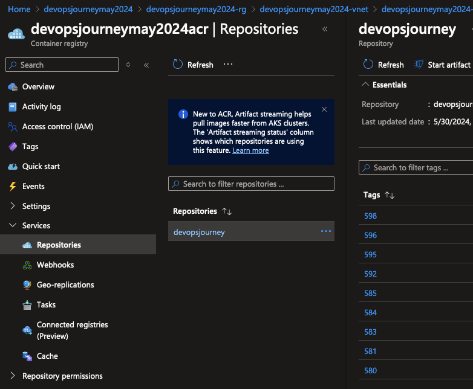
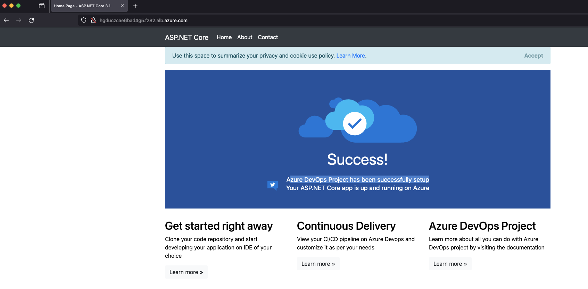

# Update Pipeline to Deploy asp Application to AKS

1. Modify the .yaml File with Your ACR Name and Image Tag

Update the YAML file with your Azure Container Registry (ACR) name and the image tag. You can find the specific line to update [here](https://github.com/thomast1906/DevOps-Journey-Using-Azure-DevOps/blob/main/labs/4-Deploy-App-AKS/pipelines/scripts/aspnet.yaml#L19)

example:
`image: devopsjourneymay2024acr.azurecr.io/devopsjourney:592`

2. Update the Pipeline in Azure DevOps Repository

Make the following updates to the Azure DevOps pipeline:
- Add Deploy Sample Application Stage:
ncorporate the stage to deploy the sample application as shown [here](https://github.com/thomast1906/DevOps-Journey-Using-Azure-DevOps/blob/main/labs/4-Deploy-App-AKS/pipelines/lab4pipeline.yaml#L104-L144)

- Update Values:
Update the resource names as shown [here]((https://github.com/thomast1906/DevOps-Journey-Using-Azure-DevOps/blob/main/labs/4-Deploy-App-AKS/pipelines/lab4pipeline.yaml#L120-L125))
  - AKS_RG: AKS Resource Group Name 
  - AKS_NAME: AKS Cluster Name
  - VNET_NAME: VNET Name

This script will retrieve the AKS credentials and deploy the specified YAML file, which will in turn deploy the sample application along with its associated service and ingress (Azure Application Gateway for Containers).

3. Notice reference of [AIKEY](https://github.com/thomast1906/DevOps-Journey-Using-Azure-DevOps/blob/main/labs/4-Deploy-App-AKS/pipelines/lab4pipeline.yaml#L131)? You created and added this to a variable group in a previous step. 

4. Test the Application URL

Access the Fully Qualified Domain Name (FQDN) to view the sample application.

`fqdn=$(kubectl get gateway gateway-01 -n sampleapp -o jsonpath='{.status.addresses[0].value}')
echo "http://$fqdn"
`

Use the address obtained to access the application, for example:
`http://hgduczcae6bad4g5.fz82.alb.azure.com`

